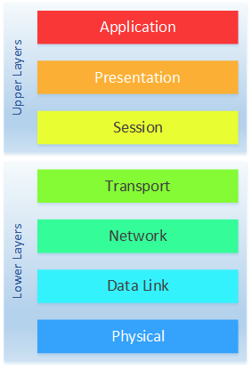

# OSI Layers Models

Nama	: Daniar Oktavian Dwiputra

Kelas	: 2 D4 IT A

NRP	: 3122600030

Model OSI( Open System Interconnection) diciptakan oleh International Organization for Standardization (ISO) yang digunakan untuk proses komunikasi data antar komputer melalui jaringan. Sebelum adanya OSI setiap vendor komputer menggunakan protokol dan format data yang berbeda-beda. Dengan adanya OSI komputer dari vendor yang berbeda-beda dapat terhubung melalui jaringan karena adanya protokol yang sudah terstandarisasi. 

Model OSI terdapat 7 lapisan yaitu 
<ul>
	<li> Application Layer
	<li> Presentation Layer
	<li> Session Layer
	<li> Transport Layer
	<li>Network Layer
	<li> Data-link Layer
	<li> Physical Layer
</ul>

Penjelasan Setiap Layer OSI

1.	Application Layer
Aplication Layer berfungsi sebagai antarmuka yang menjembatani user dengan menggunakan aplikasi yang memiliki fungsionalitas jaringan, mengatur bagaimana aplikasi dapat mengakses jaringan, dan kemudian membuat pesan-pesan kesalahan. Protokol yang berada pada lapisan ini adalah HTTP, FTP, SMTP, dan NFS.

2.	Presentation Layer
Layer ini berfungsi menyiapkan data untuk layer aplikasi pada komputer receiver. Di layer ini juga bertugas untuk mengatur bagaimana kedua perangkat yang terhubung melakukan proses enkripsi-dekripsi dan kompresi data sehingga dapat diterima secara utuh. Sedangkan pada komputer sender, layer ini menerima data dari layer aplikasi dan menyiapkannya untuk ditransmisikan ke Layer session. 

3.	Session Layer
Session Layer membuat communication channels yang disebut session antar perangkat. Session bertanggungjawab untuk, memulai koneksi, memastikan koneksi tetap terbuka dan fungsional selama data sedang ditransfer, dan mengakhirinya setelah transfer data terselesaikan. Selain itu, session layer dapat membuat checkpoint selama transfer data, jika session terganggu, perangkat dapat melanjutkan transfer data dari checkpoint terakhir.

4.	Transport Layer
Pada perangkat sender, layer ini menerima data dari Layer Session yang kemudian memecahnya menjadi segment. Sedangkan, pada perangkat receiver, layer ini bertugas menyusun kembali segment-segment yang telah diterima yang kemudian dapat diolah pada Session Layer. Pada Transport Layer terdapat error control yang mengecek apakah data diterima benar, jika tidak maka perangkat yang menerima akan meminta untuk dikirim lagi. Contoh protokol yang digunakan adalah TCP dan UDP.

5.	Network Layer
Network Layer bertugas untuk mengubah segment menjadi packet dan menyusunnya kembali pada perangkat yang menerima. Dan juga bertugas untuk melakukan routing packets dengan cara mencari jalur terbaik melalui physical network. Protokol yang digunakan berupa IP (Internet Protocol).

6.	Data-link Layer
Data-link Layer memecah packets menjadi frame dan mengirimnya dari perangkat asal ke perangkat tujuan. Pada Layer ini terdapat flow control yang mengatur seberapa cepat data dapat dikirim sesuai dengan kecepatan koneksi pada perangkat yang menerima, Logical Link Control (LLC), dan Media Access Control (MAC).

7.	Physical Layer 
Layer ini bertugas mendefinisikan media transmisi jaringan, sinkronasi bit, arsitektur jaringan, topologi jaringan, dan pengkabelan. Physical layer juga bertanggung jawab untuk mentransmisikan data melalui media jaringan.
