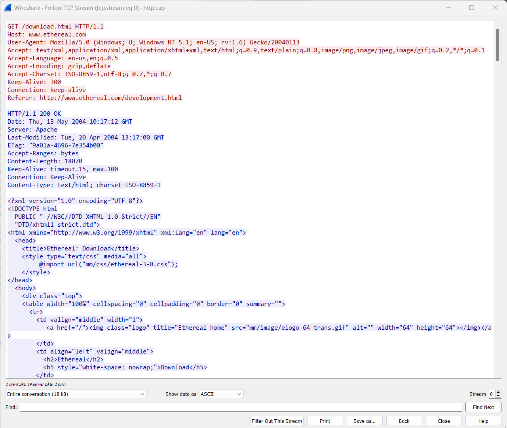
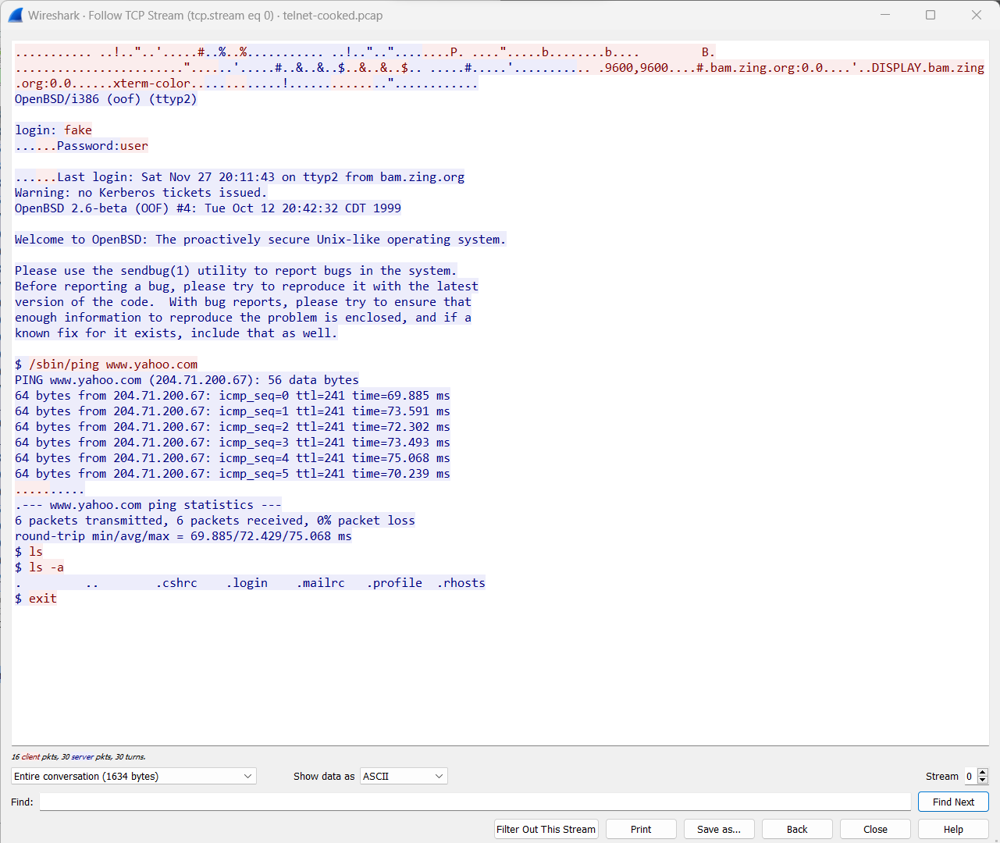
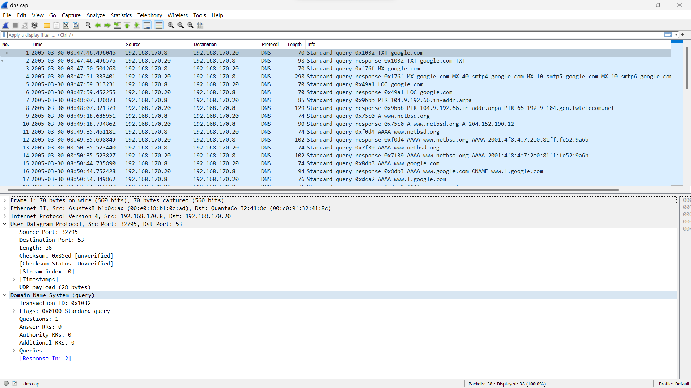

# Analisis http.cap, telnet-cooked.cap, dan dns.cap pada Wireshark

## http.cap  

Teks berwarna merah merupakan request yang dikirimkan oleh client ke server, dimana request ini berisikan method GET dan versi HTTP/1.1 yang dikirimkan kepada server dengan alamat www.ethereal.com  

Sedangkan teks berwarna biru merupakan response yang dikirimkan oleh server ke client, dengan kode status 200 (OK). Pada respone terdapat tanggal dikirimnya (13 May 2004) dan tanggal terakhir kali file HTML tersebut dimodifikasi (20 April 2004).  

## telnet-cooked.cap  

Dari gambar di atas, dapat dilihat user credentials berupa username (fake) dan passsword (user) yang digunakan untuk masuk ke server Telnet. Selain itu juga dapat melihat kapan terakhir kali login (27 November). Serta dapat melihat perintah yang dijalankan pada server telnet, pada kasus ini berupa *$ /sbin/ping www.yahoo.com* yang merupakan perintah untuk melakukan ping ke server yahoo.com.  

## dns.cap

Pada gambar di atas source merupakan perangkat yang menginisiasi permintaan DNS, yang meminta server DNS untuk mencari tahu alamat IP yang sesuai dengan nama domain yang dimasukkan.  

Destination merupakan server DNS yang menerima permintaan dari source yang kemudian menceri informasi yang diperlukan dalam database server DNS atau meneruskan permintaan ke server lain jika informasi tersebut tidak terdapat pada server DNS tersebut.