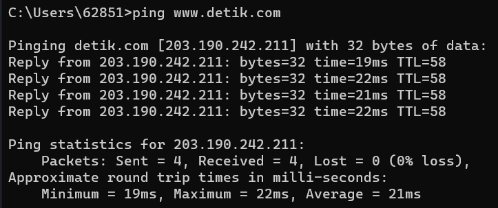
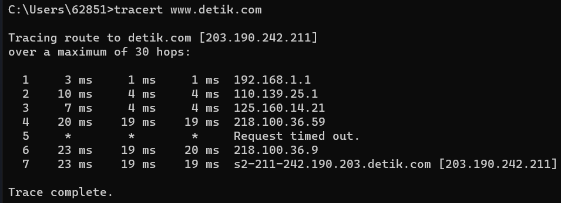

# Ping dan Traceroute

## Ping

Ping adalah suatu perintah yang diberikan dengan maksud untuk memeriksa respon klien dan server pada sebuah jaringan. Ping merupakan singkatan dari Packet Internet Gopher. Prinsip utama dari cara kerja ping mirip seperti penggunaan sonar untuk mengukur kedalaman laut. Klien akan mengirimkan paket data berupa ICMP_ECHO kepada host target yang kemudian akan mengirimkan balasan berupa ICMP_ECHOREPLY. Jika klien mendapat balasan maka artinya server atau host tersebut sedang aktif.  
Ping memiliki beberapa fungsi, diantaranya :  
1. Memeriksa Kualitas Jaringan
2. Uji Coba Akses Website
3. Memeriksa Respon Koneksi Jaringan

  
- Reply : Berisi informasi balasan dari host yang sedang di ping, alamat IP dari host dapat diketahui pada baris ini. Biasanya ada empat balasan dari host, tetapi tidak menutup kemungkinan terjadi RTO (Request Time Out), hal ini menandakan tidak adanya balasan hingga waktu tunggu ping habis.  
- Bytes : Jumlah data yang dikirimkan kepada host saat proses ping. Secara default OS Windows akan mengirimkan 32 bytes data.  
- Time : Merupakan durasi respon yang dihitung dalam milisecond. Waktu ping yang baik kurang dari 100 ms, jika lebih aka akan terasa lag.  
- TTL (Time To Live) : Merupakan durasi paket data selama berada dalam jaringan. Satuan pengukuran yang digunakan adalah second dengan kisaran waktu standar selama 64 detik.  

## Traceroute

Tracert adalah perintah untuk menunjukkan rute yang dilewati paket untuk mencapai tujuan, dengan cara mengirim pesan Internet Control Message Protocol (ICMP). Echo Request ke tujuan dengan nilai Time to Live yang semakin meningkat.
Rute yang ditampilkan adalah daftar interface router (yang paling dekat dengan host) yang terdapat pada jalur antata host dan tujuan. Traceroute digunakan sebagai untuk menganalisa kemungkinan penyaebab tidak bisa mengakses suatu website.

Fungsi dari traceroute antara lain :
1. Membantu mencari di mana letak masalah pada jaringan
2. membantu mengetahui jika server website bermasalah lewat pelakan rute yang dilakukan
3. Melihat nama ISP dan jaringan yang digunakan (biasanya muncul pada hop ke 4)
4. Memantau kualitas jaringan perangkat berdasarkan respon saat melakukan traceroute

- Hop 1-3 terjadi pada perangkat kita sendiri
- Hop di tengah di tengah terjadi pada ISP
- hop di akhir terjadi pada server tujuan

- **Tanda bintang (\*)**  
Server pada hop tersebut tidak merespon permintaan tracert yang dapat menampilkan **Request Time Out** yang dapat berarti server tidak menerima pesan ICMP dan kemungkinan server sedang sibuk atau bermasalah